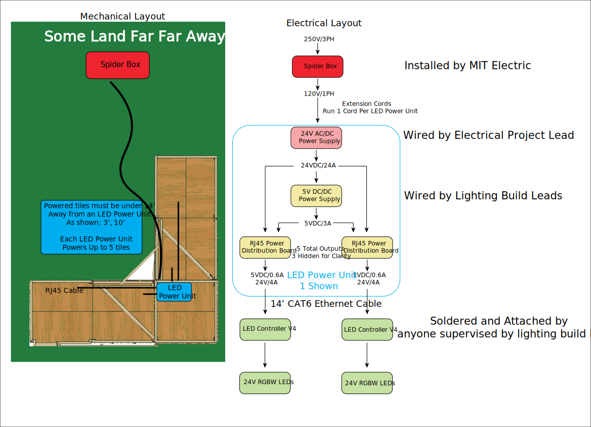

# LED-Controller-V3
Version 3 of a easy-to-deploy, low-cost PCBA to control LED lights over Wi-Fi. Designed for use at MIT's East Campus REX event to light up large forts and structures at distances of over 28 ft.

[Interactive BOM](https://htmlpreview.github.io/?https://raw.githubusercontent.com/wszeto9/LED-Controller-V3/main/Documentation/bom/ibom.html)

[PDF Schematic](https://github.com/wszeto9/LED-Controller-V3/blob/main/PCB/LED_Controller_V3.pdf)

**Features:**

- All surface-mount components are basic components that can be placed with JLCPCB's SMT service
- All components that require hand-soldering are through-hole

- Power is transmitted through 14' long ethernet cables to simplify wiring

- Power Input is fused with Mini Blade Fuses

**High-Level Power Distribution Plan**

1. MIT Electric installs a Spider Box that is approximately 50 ft. away from the structure. The Spider Box has numerous 120V outlets that can be used to pull power for the lights.

2. Extension cords are ran from the Spider Box to the DJ Station, as well as other points on the structure as needed. 

3. Power supples (24V/16A, AC to DC) are wired up to the extension cords at all locations that need power. 

4. Each node has a 24V to 5V DC-DC buck converter. This supplies the 5V for all microcontrollers. 

5. 24V and 5V are wired into the power distribution PCB

6. Ethernet cables are run between the power distrubution PCB and nodes. Each node consists of an LED Controller board(this project) and a strip of lights.

**Power Input** 

The Power Distrubution PCB has jumpers that determine the voltage that the LED Controller receives. The LED Power Voltage shall be the same as the LEDs' rated voltage. For instance, 12V Addressible LEDs need 12V Power. The Power Distribution PCB also distributes 5V through the same Ethernet cable. This powers the ESP for changing lighting configurations over Wi-Fi. 

**Fuses** 

This board fuses the LED Power to protect the traces and wires from potential shorts. It is suggested to populate the fuse with one that is rated for 1.5x its current consumption at full brightness. Please note, the RJ45 Connector is rated for 1.5A per connector, for a total of 4.5A for LED Power and 3A for 5V. For this reason, fuses shall not exceed 5A. 

**LED Indicators**

If the board is fully functional, the following LEDs should be continuously lit:

- VCC shall be lit if VCC is higher than 5V and 5V is present

- 5V shall be lit if 5V is present

- 3.3V shall be lit if the 3.3V LDO is populated and 3.3V is present

**Optional to Populate**
- The 5V Buck converter does not need to be populated if the distribution PCB supplies 5V. 

- The 3.3V LDO does not need to be populated if the MCU has a reliable 3.3V LDO built-in. In this case, remove R4 and jump R3.

**Pinouts and Outputs**

Follow the table to set the correct pins to control the LEDs. Both the Wemos D1 and S2 mini are compatable with the Control Board. 
| Wemos D1 GPIO Pin| S2 Mini GPIO Pin| Function |
| -----------------|-----------------| -------- |
| 4|33|Addressible LED 1|
| 5|35|Addressible LED 2|
|14|7 |Analog White
|12|9|Analog Blue
|13|11|Analog Red
|15|12|Analog Green

